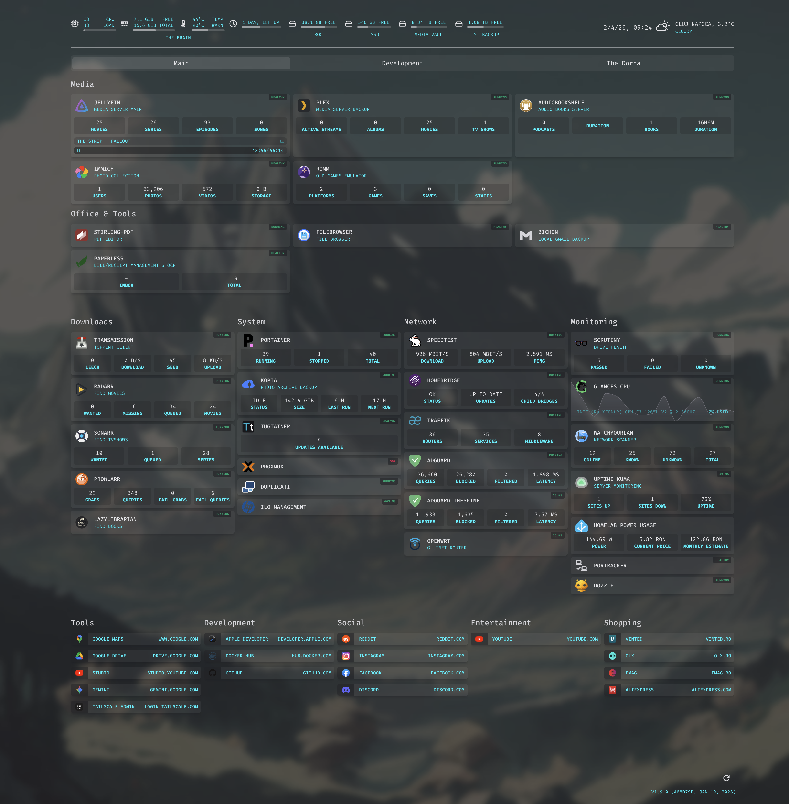

# 🧠 THE BRAIN // Homeserver Dashboard

## Homepage Config Files
A personal collection of example configuration files for [homepage](https://github.com/gethomepage/homepage).



Welcome to **TheBrain**, the central nervous system of my growing homelab. This repository contains my configuration for [GetHomepage](https://gethomepage.dev/), featuring a custom Cyberpunk-inspired aesthetic.

## 🚀 The Journey

This is my **very first project** using **Docker**. It marks the beginning of my homelab journey, moving away from simple setups to a structured, containerized environment. 

As I am currently in the learning phase, this project was developed with the extensive help of **Google Gemini**. The AI acted as my thought partner, helping me troubleshoot Docker socket permissions, GID mapping, and CSS styling, turning a complex learning curve into an exciting build.

## ⚡ Features

- **Cyberpunk UI:** Custom CSS with neon glow effects, glitch-style headers, and a terminal-inspired font (Fira Code).
- **Security First:** All sensitive data (API keys, IP addresses, GPS coordinates) is abstracted into a `.env` file to keep the public config safe.
- **Service Integration:** Real-time stats for Jellyfin, Plex, Audiobookshelf, AdGuard Home, and more.
- **Hardware Monitoring:** Deep integration with HP iLO 4 (Gen8), Scrutiny for HDD health, and Glances for system resources.

## 🛠️ Tech Stack

- **Host:** HP ProLiant Gen8 (TheBrain)
- **Containerization:** Docker & Docker Compose
- **Dashboard:** GetHomepage
- **AI Mentorship:** Google Gemini

## 📂 Project Structure

```text
├── config/
│   ├── services.yaml   # Service definitions & widgets
│   ├── settings.yaml   # Layout & UI settings
│   ├── widgets.yaml    # System resource widgets
│   ├── custom.css      # The Cyberpunk magic (Neon/Glow)
│   └── docker.yaml     # Docker socket connection
├── docker-compose.yaml # The "recipe" for the container
└── .env.example        # Template for sensitive variables
